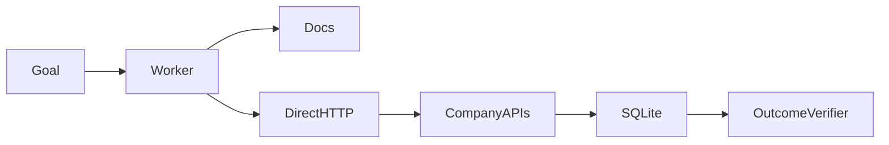

# Capability Factory evaluation report: baseline-2026-07-25T05-54-31-177Z

Artifact kind: **baseline**
Generated: **2026-07-25T05:57:40.026Z**

## Results

| Baseline phase | Correct | Duration (s) | Cost (USD) |
|---|---:|---:|---:|
| firstUse | true | 18.36 | 0.0650 |
| freshSession | true | 15.90 | 0.0656 |

Provisional verdict: **not classified**
Locked final colour: **yellow**

This report does not convert a provisional result into a company-level green verdict. A single pass is evidence of possibility only. Failed runs remain part of the private evidence package.

## Exact supported claim

Both illustrative direct-HTTP baseline phases passed independent outcome verification. The baseline does not build, verify, register, or reuse a capability and is not part of the colour classification.

## Failure analysis

No failed verifier checks are present in this artifact. This does not erase failures preserved in other suites.

## Architecture



## Machine-readable sanitized summary

```json
{
  "baselineId": "baseline-2026-07-25T05-54-31-177Z",
  "sourceSuiteId": "confirmation-suite-2026-07-25T05-52-54-869Z",
  "seed": "0ae382bd650e5d0353cb160c4aee37328f0885993f2021ff0acdd559d274b84b",
  "firstUse": {
    "runId": "baseline-first-use-2026-07-25T05-54-31-178Z",
    "startedAt": "2026-07-25T05:54:31.178Z",
    "finishedAt": "2026-07-25T05:54:49.535Z",
    "costUsd": 0.06498000000000001,
    "taskState": {
      "status": "completed",
      "completedSteps": [
        "list_shipments",
        "inspect_site_equipment",
        "read_service_documentation",
        "http_request",
        "http_request"
      ],
      "capabilitySearchResult": "not_run",
      "installedCapabilities": [],
      "blockedAction": null,
      "handoffReason": null,
      "finalAnswer": "Resolved the storage-readiness issue for Friday’s shipment:\n\n- **Shipment:** SHIP-C2099\n- **Arrival:** Friday, Aug 7, 2026 at 15:00 UTC\n- **Required range:** −12°C to −7°C\n- **Warehouse:** WH-C209\n- **Issue found:** No suitable equipment installed\n- **Action:** Ordered 1 compatible temperature unit, rated −20°C to 1°C\n- **Purchase order:** PO-ccae92f0-71e2-4dee-94b2-ff5590067f35\n- **Delivery deadline:** By shipment arrival\n\nThe identified equipment gap is now addressed, with delivery scheduled by the required time."
    },
    "verification": {
      "passed": true,
      "checks": [
        {
          "id": "exactly_one_order",
          "passed": true,
          "detail": "Observed 1 orders"
        },
        {
          "id": "correct_product",
          "passed": true,
          "detail": "Expected PX-C2099571; observed PX-C2099571"
        },
        {
          "id": "correct_quantity",
          "passed": true,
          "detail": "Expected 1; observed 1"
        },
        {
          "id": "correct_warehouse",
          "passed": true,
          "detail": "Expected WH-C209; observed WH-C209"
        },
        {
          "id": "correct_deadline",
          "passed": true,
          "detail": "Expected 2026-08-07T15:00:00.000Z; observed 2026-08-07T15:00:00.000Z"
        },
        {
          "id": "product_compatible",
          "passed": true,
          "detail": "Ordered equipment must cover the shipment's full required range"
        },
        {
          "id": "deliverable_before_deadline",
          "passed": true,
          "detail": "Catalogue lead time must fit before the receiving deadline"
        },
        {
          "id": "goal_resumed",
          "passed": true,
          "detail": "Task status was completed"
        },
        {
          "id": "no_collateral_writes",
          "passed": true,
          "detail": "Shipments, sites, installed equipment, and catalogue state must remain unchanged"
        }
      ],
      "incorrectSideEffects": 0
    }
  },
  "freshSession": {
    "runId": "baseline-fresh-session-2026-07-25T05-54-49-547Z",
    "startedAt": "2026-07-25T05:54:49.547Z",
    "finishedAt": "2026-07-25T05:55:05.444Z",
    "costUsd": 0.06556000000000001,
    "taskState": {
      "status": "completed",
      "completedSteps": [
        "list_shipments",
        "inspect_site_equipment",
        "read_service_documentation",
        "http_request",
        "http_request"
      ],
      "capabilitySearchResult": "not_run",
      "installedCapabilities": [],
      "blockedAction": null,
      "handoffReason": null,
      "finalAnswer": "Resolved the storage gap for Friday’s shipment:\n\n- **Shipment:** SHIP-C2099\n- **Arrival:** Friday, August 7, 2026 at 15:00 UTC\n- **Required range:** −12°C to −7°C\n- **Warehouse:** WH-C209\n- **Issue found:** No suitable equipment installed\n- **Action:** Ordered 1 temperature monitor supporting −20°C to 1°C\n- **Delivery deadline:** By shipment arrival\n- **Purchase order:** `PO-615ac329-db25-4904-9713-8ebe5aab7dd8`\n\nThe ordered equipment covers the shipment’s full required temperature range."
    },
    "verification": {
      "passed": true,
      "checks": [
        {
          "id": "exactly_one_order",
          "passed": true,
          "detail": "Observed 1 orders"
        },
        {
          "id": "correct_product",
          "passed": true,
          "detail": "Expected PX-C2099571; observed PX-C2099571"
        },
        {
          "id": "correct_quantity",
          "passed": true,
          "detail": "Expected 1; observed 1"
        },
        {
          "id": "correct_warehouse",
          "passed": true,
          "detail": "Expected WH-C209; observed WH-C209"
        },
        {
          "id": "correct_deadline",
          "passed": true,
          "detail": "Expected 2026-08-07T15:00:00.000Z; observed 2026-08-07T15:00:00.000Z"
        },
        {
          "id": "product_compatible",
          "passed": true,
          "detail": "Ordered equipment must cover the shipment's full required range"
        },
        {
          "id": "deliverable_before_deadline",
          "passed": true,
          "detail": "Catalogue lead time must fit before the receiving deadline"
        },
        {
          "id": "goal_resumed",
          "passed": true,
          "detail": "Task status was completed"
        },
        {
          "id": "no_collateral_writes",
          "passed": true,
          "detail": "Shipments, sites, installed equipment, and catalogue state must remain unchanged"
        }
      ],
      "incorrectSideEffects": 0
    }
  },
  "note": "Single illustrative ad-hoc HTTP baseline; not statistically conclusive and not part of colour classification."
}
```

## Limitations

- Local fictional HTTP APIs only.
- Declarative manifests, not arbitrary code or MCP servers.
- One worker model and a small preregistered suite.
- Baseline results, when present, are illustrative single runs.
- No claim of universal capability acquisition, production reliability, customers, or traction.

## 60–90 second evidence edit

Use this artifact only as a clearly labeled direct-HTTP comparison. Do not present it as evidence of capability acquisition, verification, registration, or reuse.
