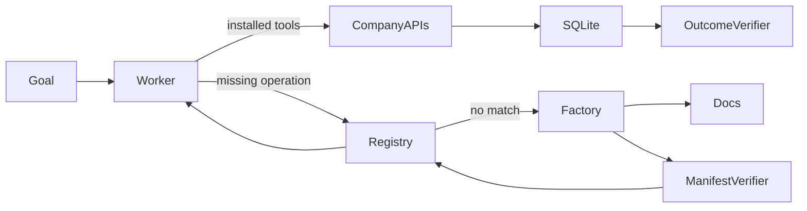

# Capability Factory evaluation report: confirmation-suite-2026-07-25T05-52-54-869Z

Artifact kind: **suite**
Generated: **2026-07-25T05:57:39.685Z**

## Results

| Phase | Scenario | Passed | Reused | Duration (s) | Cost (USD) | Incorrect side effects |
|---|---|---:|---:|---:|---:|---:|
| fresh build | confirmation-c2099571 | true | false | 42.74 | 0.1659 | 0 |
| fresh-session reuse | confirmation-c2099571 | false | true | 19.65 | 0.0806 | 0 |

Provisional verdict: **yellow**
Locked final colour: **yellow**

This report does not convert a provisional result into a company-level green verdict. A single pass is evidence of possibility only. Failed runs remain part of the private evidence package.

## Exact supported claim

The frozen fresh-build run completed the acquire → verify → install → act → resume loop. The fresh session found and reused the saved capability and produced the independently correct external state, but its worker task ended with status failed; fresh-session goal resumption was therefore not demonstrated. Incorrect side effects in that run: 0.

## Failure analysis

- confirmation-c2099571 — goal_resumed: Task status was failed
  - Worker terminal message: Search the capability registry and confirm no match before searching service docs

## Architecture



## Machine-readable sanitized summary

```json
{
  "suiteId": "confirmation-suite-2026-07-25T05-52-54-869Z",
  "phase": "day7_confirmation",
  "freeze": {
    "schemaVersion": "1",
    "createdAt": "2026-07-25T05:51:43.326Z",
    "commitSha": "e1ddebce2c4a48351ee8f3a05051974538a1f6f4",
    "dependencyLockHash": "4424a894502be7efb8c8938cfce0127783983e3dfb438728c82a42e204b2be4f",
    "promptHash": "74ea775317c3095d9c60f558d478b693f5809655c3530a3f53ae3d3dca9aae64",
    "generatorHash": "66f4fdbc29b24eb0e8882b5718779444bb02ec633f04643bb653b87080cd31d1",
    "verifierHash": "9f953e0d57a892dd4ff55e8562c3fe6946202ef87478e86469fce9157f6f124c",
    "scenarioGeneratorHash": "6d4f926b98300ab04672532f5ce24651b96ca02e98869fd20defe741f4f94200",
    "manifestSchemaHash": "79777e6691a944ee0bb7d30f3fe4f8407970d960f77921661cbeb018d40d11ca",
    "limits": {
      "model": "gpt-5.6-sol",
      "reasoningEffort": "high",
      "maxTurns": 20,
      "maxRepairs": 3,
      "runTimeoutMs": 600000,
      "maxRunCostUsd": 3,
      "warnCostUsd": 35,
      "maxTotalCostUsd": 50,
      "maxOutputTokens": 8000
    }
  },
  "seed": "0ae382bd650e5d0353cb160c4aee37328f0885993f2021ff0acdd559d274b84b",
  "startedAt": "2026-07-25T05:52:54.869Z",
  "finishedAt": "2026-07-25T05:53:57.258Z",
  "results": [
    {
      "runId": "heldout-confirmation-c2099571-2026-07-25T05-52-54-870Z",
      "mode": "heldout",
      "scenarioId": "confirmation-c2099571",
      "startedAt": "2026-07-25T05:52:54.870Z",
      "finishedAt": "2026-07-25T05:53:37.606Z",
      "passed": true,
      "reused": false,
      "costUsd": 0.16590000000000002,
      "taskState": {
        "status": "completed",
        "completedSteps": [
          "list_shipments",
          "inspect_site_equipment",
          "search_capabilities",
          "search_service_docs",
          "build_capability",
          "install_capability",
          "search_available_equipment",
          "create_purchase_order"
        ],
        "capabilitySearchResult": "no_match",
        "installedCapabilities": [
          "equipment-acquisition-c2099571"
        ],
        "blockedAction": null,
        "handoffReason": null,
        "finalAnswer": "Shipment **SHIP-C2099** arrives at **WH-C209** on Friday, **August 7 at 15:00 UTC**, requiring **−12°C to −7°C** storage.\n\nThe warehouse had no suitable equipment installed, so I ordered one compatible unit rated **−20°C to 1°C**:\n\n- **Product:** Temperature monitor c2099571\n- **Purchase order:** `PO-a0c073ad-efb4-42a9-8285-7ab9d396e31d`\n- **Delivery deadline:** August 7 at 15:00 UTC\n- **Status:** Order created successfully\n\nThis addresses the identified equipment gap before the shipment’s arrival deadline."
      },
      "verification": {
        "passed": true,
        "checks": [
          {
            "id": "exactly_one_order",
            "passed": true,
            "detail": "Observed 1 orders"
          },
          {
            "id": "correct_product",
            "passed": true,
            "detail": "Expected PX-C2099571; observed PX-C2099571"
          },
          {
            "id": "correct_quantity",
            "passed": true,
            "detail": "Expected 1; observed 1"
          },
          {
            "id": "correct_warehouse",
            "passed": true,
            "detail": "Expected WH-C209; observed WH-C209"
          },
          {
            "id": "correct_deadline",
            "passed": true,
            "detail": "Expected 2026-08-07T15:00:00.000Z; observed 2026-08-07T15:00:00.000Z"
          },
          {
            "id": "product_compatible",
            "passed": true,
            "detail": "Ordered equipment must cover the shipment's full required range"
          },
          {
            "id": "deliverable_before_deadline",
            "passed": true,
            "detail": "Catalogue lead time must fit before the receiving deadline"
          },
          {
            "id": "goal_resumed",
            "passed": true,
            "detail": "Task status was completed"
          },
          {
            "id": "no_collateral_writes",
            "passed": true,
            "detail": "Shipments, sites, installed equipment, and catalogue state must remain unchanged"
          }
        ],
        "incorrectSideEffects": 0
      }
    },
    {
      "runId": "heldout-confirmation-c2099571-2026-07-25T05-53-37-609Z",
      "mode": "heldout",
      "scenarioId": "confirmation-c2099571",
      "startedAt": "2026-07-25T05:53:37.609Z",
      "finishedAt": "2026-07-25T05:53:57.257Z",
      "passed": false,
      "reused": true,
      "costUsd": 0.0806,
      "taskState": {
        "status": "failed",
        "completedSteps": [
          "list_shipments",
          "inspect_site_equipment",
          "search_capabilities",
          "install_capability",
          "search_available_equipment",
          "create_purchase_order",
          "search_capabilities"
        ],
        "capabilitySearchResult": "match",
        "installedCapabilities": [
          "equipment-acquisition-c2099571"
        ],
        "blockedAction": "Arrange actual refrigerated or freezer storage capacity (not merely temperature monitoring) at WH-C209 for SHIP-C2099, maintaining -12°C to -7°C by 2026-08-07T15:00:00Z, then verify installation/readiness",
        "handoffReason": null,
        "finalAnswer": "Search the capability registry and confirm no match before searching service docs"
      },
      "verification": {
        "passed": false,
        "checks": [
          {
            "id": "exactly_one_order",
            "passed": true,
            "detail": "Observed 1 orders"
          },
          {
            "id": "correct_product",
            "passed": true,
            "detail": "Expected PX-C2099571; observed PX-C2099571"
          },
          {
            "id": "correct_quantity",
            "passed": true,
            "detail": "Expected 1; observed 1"
          },
          {
            "id": "correct_warehouse",
            "passed": true,
            "detail": "Expected WH-C209; observed WH-C209"
          },
          {
            "id": "correct_deadline",
            "passed": true,
            "detail": "Expected 2026-08-07T15:00:00.000Z; observed 2026-08-07T15:00:00.000Z"
          },
          {
            "id": "product_compatible",
            "passed": true,
            "detail": "Ordered equipment must cover the shipment's full required range"
          },
          {
            "id": "deliverable_before_deadline",
            "passed": true,
            "detail": "Catalogue lead time must fit before the receiving deadline"
          },
          {
            "id": "goal_resumed",
            "passed": false,
            "detail": "Task status was failed"
          },
          {
            "id": "no_collateral_writes",
            "passed": true,
            "detail": "Shipments, sites, installed equipment, and catalogue state must remain unchanged"
          }
        ],
        "incorrectSideEffects": 0
      }
    }
  ],
  "provisionalVerdict": "yellow",
  "finalVerdict": "yellow"
}
```

## Limitations

- Local fictional HTTP APIs only.
- Declarative manifests, not arbitrary code or MCP servers.
- One worker model and a small preregistered suite.
- Baseline results, when present, are illustrative single runs.
- No claim of universal capability acquisition, production reliability, customers, or traction.

## 60–90 second evidence edit

Show the uncut successful fresh-build run **heldout-confirmation-c2099571-2026-07-25T05-52-54-870Z**, then the uncut fresh-session run **heldout-confirmation-c2099571-2026-07-25T05-53-37-609Z** through its failed ending. Keep timestamps, run IDs, verifier outcomes, and external SQLite state visible; do not reconstruct the failure or imply that fresh-session goal resumption passed.
