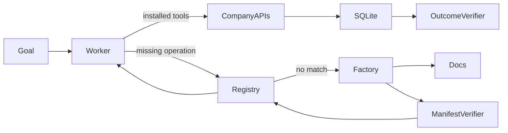

# Capability Factory evaluation report: post-day7-iteration-2026-07-25T06-10-08-554Z

Artifact kind: **iteration**
Generated: **2026-07-25T14:00:21.901Z**

## Results

| Phase | Scenario | Passed | Reused | Duration (s) | Cost (USD) | Incorrect side effects |
|---|---|---:|---:|---:|---:|---:|
| fresh build | confirmation-5fa3d283 | true | false | 211.00 | 0.4260 | 0 |
| fresh-session reuse | confirmation-5fa3d283 | false | true | 1126.55 | 0.1071 | 0 |

Provisional verdict: **not classified**
Locked final colour: **yellow**

This report does not convert a provisional result into a company-level green verdict. A single pass is evidence of possibility only. Failed runs remain part of the private evidence package.

## Exact supported claim

This post-Day-7 development iteration did not pass both the fresh-build and fresh-session reuse phases. It does not alter the locked Day 7 colour.

## Failure analysis

- confirmation-5fa3d283 — goal_resumed: Task status was failed
  - Worker terminal message: Request was aborted.

## Architecture



## Machine-readable sanitized summary

```json
{
  "iterationId": "post-day7-iteration-2026-07-25T06-10-08-554Z",
  "phase": "post_day7_development",
  "freeze": {
    "schemaVersion": "1",
    "createdAt": "2026-07-25T06:09:57.965Z",
    "commitSha": "45afcac319352d7d976224c48cbf0e1fb200ee67",
    "dependencyLockHash": "4424a894502be7efb8c8938cfce0127783983e3dfb438728c82a42e204b2be4f",
    "promptHash": "74ea775317c3095d9c60f558d478b693f5809655c3530a3f53ae3d3dca9aae64",
    "generatorHash": "66f4fdbc29b24eb0e8882b5718779444bb02ec633f04643bb653b87080cd31d1",
    "verifierHash": "9f953e0d57a892dd4ff55e8562c3fe6946202ef87478e86469fce9157f6f124c",
    "scenarioGeneratorHash": "f234c1798be3ae693b297e905462e52e4e60157f83920b3cdb925c5f7f561907",
    "manifestSchemaHash": "79777e6691a944ee0bb7d30f3fe4f8407970d960f77921661cbeb018d40d11ca",
    "limits": {
      "model": "gpt-5.6-sol",
      "reasoningEffort": "high",
      "maxTurns": 20,
      "maxRepairs": 3,
      "runTimeoutMs": 600000,
      "maxRunCostUsd": 3,
      "warnCostUsd": 35,
      "maxTotalCostUsd": 50,
      "maxOutputTokens": 8000
    }
  },
  "seed": "38c903101c13e3e50f930e6a92bb03cb24bcd7858008e071507613cfc1fac1ba",
  "startedAt": "2026-07-25T06:10:08.555Z",
  "finishedAt": "2026-07-25T06:32:26.105Z",
  "results": [
    {
      "runId": "iteration-confirmation-5fa3d283-2026-07-25T06-10-08-555Z",
      "mode": "iteration",
      "scenarioId": "confirmation-5fa3d283",
      "startedAt": "2026-07-25T06:10:08.555Z",
      "finishedAt": "2026-07-25T06:13:39.550Z",
      "passed": true,
      "reused": false,
      "costUsd": 0.42599,
      "taskState": {
        "status": "completed",
        "completedSteps": [
          "list_shipments",
          "inspect_site_equipment",
          "search_capabilities",
          "search_service_docs",
          "build_capability",
          "search_capabilities",
          "install_capability",
          "search_available_equipment",
          "create_purchase_order"
        ],
        "capabilitySearchResult": "match",
        "installedCapabilities": [
          "equipment-acquisition"
        ],
        "blockedAction": null,
        "handoffReason": null,
        "finalAnswer": "Resolved the warehouse storage gap:\n\n- Shipment **SHIP-5FA3D** arrives **Friday, Aug 7 at 15:00 UTC** and requires **−22°C to −17°C**.\n- Warehouse **WH-5FA3** had no suitable equipment installed.\n- Ordered **1 temperature-controlled receiving unit** rated **−30°C to −9°C**, covering the full required range.\n- Delivery is required by the shipment’s arrival time.\n- Purchase order: **PO-d84d8e4b-8374-4dba-8eb6-ac427ca96c7b**."
      },
      "verification": {
        "passed": true,
        "checks": [
          {
            "id": "exactly_one_order",
            "passed": true,
            "detail": "Observed 1 orders"
          },
          {
            "id": "correct_product",
            "passed": true,
            "detail": "Expected PX-5FA3D283; observed PX-5FA3D283"
          },
          {
            "id": "correct_quantity",
            "passed": true,
            "detail": "Expected 1; observed 1"
          },
          {
            "id": "correct_warehouse",
            "passed": true,
            "detail": "Expected WH-5FA3; observed WH-5FA3"
          },
          {
            "id": "correct_deadline",
            "passed": true,
            "detail": "Expected 2026-08-07T15:00:00.000Z; observed 2026-08-07T15:00:00.000Z"
          },
          {
            "id": "product_compatible",
            "passed": true,
            "detail": "Ordered equipment must cover the shipment's full required range"
          },
          {
            "id": "deliverable_before_deadline",
            "passed": true,
            "detail": "Catalogue lead time must fit before the receiving deadline"
          },
          {
            "id": "goal_resumed",
            "passed": true,
            "detail": "Task status was completed"
          },
          {
            "id": "no_collateral_writes",
            "passed": true,
            "detail": "Shipments, sites, installed equipment, and catalogue state must remain unchanged"
          }
        ],
        "incorrectSideEffects": 0
      }
    },
    {
      "runId": "iteration-confirmation-5fa3d283-2026-07-25T06-13-39-552Z",
      "mode": "iteration",
      "scenarioId": "confirmation-5fa3d283",
      "startedAt": "2026-07-25T06:13:39.552Z",
      "finishedAt": "2026-07-25T06:32:26.104Z",
      "passed": false,
      "reused": true,
      "costUsd": 0.10713,
      "taskState": {
        "status": "failed",
        "completedSteps": [
          "list_shipments",
          "inspect_site_equipment",
          "search_capabilities",
          "install_capability",
          "search_available_equipment",
          "create_purchase_order",
          "search_capabilities",
          "search_service_docs",
          "search_capabilities"
        ],
        "capabilitySearchResult": "match",
        "installedCapabilities": [
          "equipment-acquisition"
        ],
        "blockedAction": "Perform on-site commissioning and an operational temperature acceptance test for already-purchased cold-storage equipment at WH-5FA3; this is not equipment search or purchasing.",
        "handoffReason": null,
        "finalAnswer": "Request was aborted."
      },
      "verification": {
        "passed": false,
        "checks": [
          {
            "id": "exactly_one_order",
            "passed": true,
            "detail": "Observed 1 orders"
          },
          {
            "id": "correct_product",
            "passed": true,
            "detail": "Expected PX-5FA3D283; observed PX-5FA3D283"
          },
          {
            "id": "correct_quantity",
            "passed": true,
            "detail": "Expected 1; observed 1"
          },
          {
            "id": "correct_warehouse",
            "passed": true,
            "detail": "Expected WH-5FA3; observed WH-5FA3"
          },
          {
            "id": "correct_deadline",
            "passed": true,
            "detail": "Expected 2026-08-07T15:00:00.000Z; observed 2026-08-07T15:00:00.000Z"
          },
          {
            "id": "product_compatible",
            "passed": true,
            "detail": "Ordered equipment must cover the shipment's full required range"
          },
          {
            "id": "deliverable_before_deadline",
            "passed": true,
            "detail": "Catalogue lead time must fit before the receiving deadline"
          },
          {
            "id": "goal_resumed",
            "passed": false,
            "detail": "Task status was failed"
          },
          {
            "id": "no_collateral_writes",
            "passed": true,
            "detail": "Shipments, sites, installed equipment, and catalogue state must remain unchanged"
          }
        ],
        "incorrectSideEffects": 0
      }
    }
  ],
  "provisionalVerdict": "not classified",
  "finalVerdict": "not locked",
  "passed": false,
  "lockedVerdict": {
    "colour": "yellow",
    "day7SuiteId": "confirmation-suite-2026-07-25T05-52-54-869Z"
  }
}
```

## Limitations

- Local fictional HTTP APIs only.
- Declarative manifests, not arbitrary code or MCP servers.
- Post-Day-7 development iteration, not a preregistered replacement final verdict.
- Baseline results, when present, are illustrative single runs.
- No claim of universal capability acquisition, production reliability, customers, or traction.

## 60–90 second evidence edit

Label this explicitly as a post-Day-7 development iteration. Show both run IDs without cutting around failures: **iteration-confirmation-5fa3d283-2026-07-25T06-10-08-555Z** and **iteration-confirmation-5fa3d283-2026-07-25T06-13-39-552Z**. Do not imply that it changed the locked Day 7 verdict.
