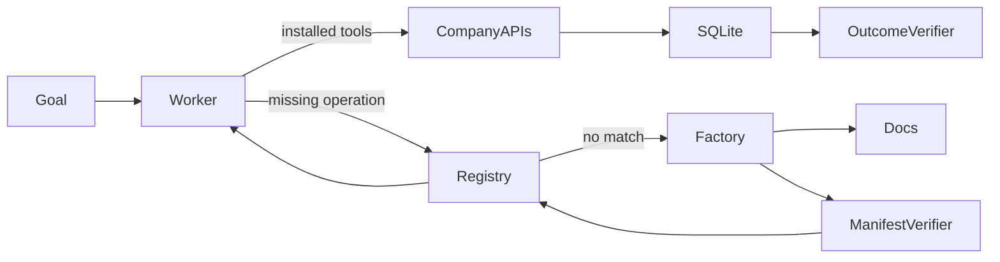

# Capability Factory evaluation report: post-day7-iteration-2026-07-25T13-56-45-165Z

Artifact kind: **iteration**
Generated: **2026-07-25T14:00:22.240Z**

## Results

| Phase | Scenario | Passed | Reused | Duration (s) | Cost (USD) | Incorrect side effects |
|---|---|---:|---:|---:|---:|---:|
| fresh build | confirmation-e29e5196 | true | false | 37.25 | 0.1538 | 0 |
| fresh-session reuse | confirmation-e29e5196 | true | true | 12.53 | 0.0579 | 0 |

Provisional verdict: **not classified**
Locked final colour: **yellow**

This report does not convert a provisional result into a company-level green verdict. A single pass is evidence of possibility only. Failed runs remain part of the private evidence package.

## Exact supported claim

This post-Day-7 development iteration passed fresh build, independent verification, correct external action, goal resumption, and fresh-session registry reuse. It is additional development evidence and does not alter the locked Day 7 colour.

## Failure analysis

No failed verifier checks are present in this artifact. This does not erase failures preserved in other suites.

## Architecture



## Machine-readable sanitized summary

```json
{
  "iterationId": "post-day7-iteration-2026-07-25T13-56-45-165Z",
  "phase": "post_day7_development",
  "freeze": {
    "schemaVersion": "1",
    "createdAt": "2026-07-25T13:56:34.191Z",
    "commitSha": "2391197616a89a5c4a0c5b8cf36cf3fd59b57cbc",
    "dependencyLockHash": "4424a894502be7efb8c8938cfce0127783983e3dfb438728c82a42e204b2be4f",
    "promptHash": "74ea775317c3095d9c60f558d478b693f5809655c3530a3f53ae3d3dca9aae64",
    "generatorHash": "66f4fdbc29b24eb0e8882b5718779444bb02ec633f04643bb653b87080cd31d1",
    "verifierHash": "9f953e0d57a892dd4ff55e8562c3fe6946202ef87478e86469fce9157f6f124c",
    "scenarioGeneratorHash": "f234c1798be3ae693b297e905462e52e4e60157f83920b3cdb925c5f7f561907",
    "manifestSchemaHash": "79777e6691a944ee0bb7d30f3fe4f8407970d960f77921661cbeb018d40d11ca",
    "limits": {
      "model": "gpt-5.6-sol",
      "reasoningEffort": "high",
      "maxTurns": 20,
      "maxRepairs": 3,
      "runTimeoutMs": 600000,
      "maxRunCostUsd": 3,
      "warnCostUsd": 35,
      "maxTotalCostUsd": 50,
      "maxOutputTokens": 8000
    }
  },
  "seed": "06382355cd6f856f648a012aeece2840d9fad12ac4ab50b86dbe5798b2b3a614",
  "startedAt": "2026-07-25T13:56:45.165Z",
  "finishedAt": "2026-07-25T13:57:34.949Z",
  "results": [
    {
      "runId": "iteration-confirmation-e29e5196-2026-07-25T13-56-45-166Z",
      "mode": "iteration",
      "scenarioId": "confirmation-e29e5196",
      "startedAt": "2026-07-25T13:56:45.166Z",
      "finishedAt": "2026-07-25T13:57:22.419Z",
      "passed": true,
      "reused": false,
      "costUsd": 0.153785,
      "taskState": {
        "status": "completed",
        "completedSteps": [
          "list_shipments",
          "inspect_site_equipment",
          "search_capabilities",
          "search_service_docs",
          "build_capability",
          "install_capability",
          "search_available_equipment",
          "create_purchase_order"
        ],
        "capabilitySearchResult": "no_match",
        "installedCapabilities": [
          "procurement-equipment-order"
        ],
        "blockedAction": null,
        "handoffReason": null,
        "finalAnswer": "Warehouse **WH-E29E** had no compatible storage equipment installed.\n\nI ordered **1 Modular cold-storage unit**:\n- Supported range: **−30°C to −9°C**\n- Shipment requirement: **−22°C to −17°C**\n- Delivery deadline: **August 7, 2026 at 15:00 UTC**\n- Purchase order: **PO-70e8ccd0-175e-49a4-8f76-ea54bde3b313**\n- Cost: **$140.86**"
      },
      "verification": {
        "passed": true,
        "checks": [
          {
            "id": "exactly_one_order",
            "passed": true,
            "detail": "Observed 1 orders"
          },
          {
            "id": "correct_product",
            "passed": true,
            "detail": "Expected PX-E29E5196; observed PX-E29E5196"
          },
          {
            "id": "correct_quantity",
            "passed": true,
            "detail": "Expected 1; observed 1"
          },
          {
            "id": "correct_warehouse",
            "passed": true,
            "detail": "Expected WH-E29E; observed WH-E29E"
          },
          {
            "id": "correct_deadline",
            "passed": true,
            "detail": "Expected 2026-08-07T15:00:00.000Z; observed 2026-08-07T15:00:00.000Z"
          },
          {
            "id": "product_compatible",
            "passed": true,
            "detail": "Ordered equipment must cover the shipment's full required range"
          },
          {
            "id": "deliverable_before_deadline",
            "passed": true,
            "detail": "Catalogue lead time must fit before the receiving deadline"
          },
          {
            "id": "goal_resumed",
            "passed": true,
            "detail": "Task status was completed"
          },
          {
            "id": "no_collateral_writes",
            "passed": true,
            "detail": "Shipments, sites, installed equipment, and catalogue state must remain unchanged"
          }
        ],
        "incorrectSideEffects": 0
      }
    },
    {
      "runId": "iteration-confirmation-e29e5196-2026-07-25T13-57-22-420Z",
      "mode": "iteration",
      "scenarioId": "confirmation-e29e5196",
      "startedAt": "2026-07-25T13:57:22.420Z",
      "finishedAt": "2026-07-25T13:57:34.947Z",
      "passed": true,
      "reused": true,
      "costUsd": 0.05788,
      "taskState": {
        "status": "completed",
        "completedSteps": [
          "list_shipments",
          "inspect_site_equipment",
          "search_capabilities",
          "install_capability",
          "search_available_equipment",
          "create_purchase_order"
        ],
        "capabilitySearchResult": "match",
        "installedCapabilities": [
          "procurement-equipment-order"
        ],
        "blockedAction": null,
        "handoffReason": null,
        "finalAnswer": "Warehouse **WH-E29E** had no storage equipment installed for shipment **SHIP-E29E5**, which requires **−22°C to −17°C**.\n\nOrdered **1 Modular cold-storage unit e29e5196**, supporting **−30°C to −9°C**, for delivery by the shipment’s arrival on **Friday, August 7, 2026 at 15:00 UTC**.\n\n**Purchase order:** `PO-74e07e2d-804c-4a99-ba0a-1e3f319544b7`"
      },
      "verification": {
        "passed": true,
        "checks": [
          {
            "id": "exactly_one_order",
            "passed": true,
            "detail": "Observed 1 orders"
          },
          {
            "id": "correct_product",
            "passed": true,
            "detail": "Expected PX-E29E5196; observed PX-E29E5196"
          },
          {
            "id": "correct_quantity",
            "passed": true,
            "detail": "Expected 1; observed 1"
          },
          {
            "id": "correct_warehouse",
            "passed": true,
            "detail": "Expected WH-E29E; observed WH-E29E"
          },
          {
            "id": "correct_deadline",
            "passed": true,
            "detail": "Expected 2026-08-07T15:00:00.000Z; observed 2026-08-07T15:00:00.000Z"
          },
          {
            "id": "product_compatible",
            "passed": true,
            "detail": "Ordered equipment must cover the shipment's full required range"
          },
          {
            "id": "deliverable_before_deadline",
            "passed": true,
            "detail": "Catalogue lead time must fit before the receiving deadline"
          },
          {
            "id": "goal_resumed",
            "passed": true,
            "detail": "Task status was completed"
          },
          {
            "id": "no_collateral_writes",
            "passed": true,
            "detail": "Shipments, sites, installed equipment, and catalogue state must remain unchanged"
          }
        ],
        "incorrectSideEffects": 0
      }
    }
  ],
  "provisionalVerdict": "not classified",
  "finalVerdict": "not locked",
  "passed": true,
  "lockedVerdict": {
    "colour": "yellow",
    "day7SuiteId": "confirmation-suite-2026-07-25T05-52-54-869Z"
  }
}
```

## Limitations

- Local fictional HTTP APIs only.
- Declarative manifests, not arbitrary code or MCP servers.
- Post-Day-7 development iteration, not a preregistered replacement final verdict.
- Baseline results, when present, are illustrative single runs.
- No claim of universal capability acquisition, production reliability, customers, or traction.

## 60–90 second evidence edit

Label this explicitly as a post-Day-7 development iteration. Show both run IDs without cutting around failures: **iteration-confirmation-e29e5196-2026-07-25T13-56-45-166Z** and **iteration-confirmation-e29e5196-2026-07-25T13-57-22-420Z**. Do not imply that it changed the locked Day 7 verdict.
